# The combination of face identification and action
recognition for fall detection
## Introduction
Falls are a very common unexpected accident in the elderly that result in serious injuries such as broken bones, head injury. Detecting falls and taking fall patients to the emergency room in time is very important. In this project, we propose a method that combines face recognition and action recognition for fall detection. Specifically, we identify seven basic actions that take place in elderly daily life based on skeleton data detected using YOLOv7-Pose model. Two deep models which are Spatial Temporal Graph Convolutional Network (ST-GCN) and Long Short-Term Memory (LSTM) are employed for action recognition on the skeleton data. The experimental results on our dataset show that ST-GCN model achieved an accuracy of 90% higher than the LSTM model by 7%. 
## video demo
https://user-images.githubusercontent.com/87271954/204276637-f5d343de-9b19-43e4-a34b-5ffb7b696d9a.mp4
## System Diagram

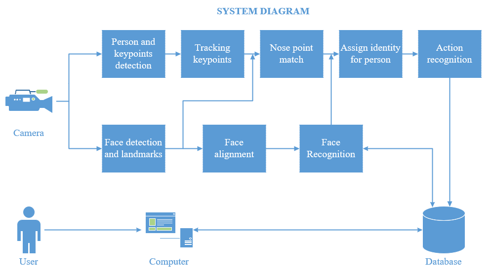
## App
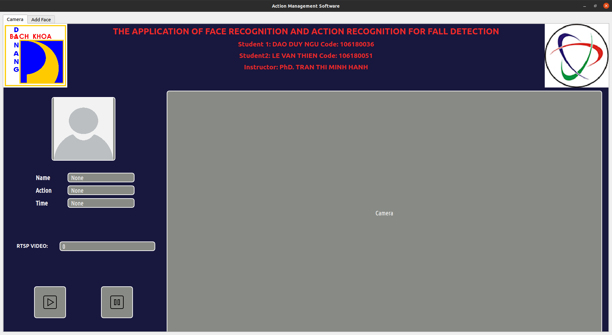
## Dev
```
Member:
 - DAO DUY NGU
 - LE VAN THIEN
Instructor: TRAN THI MINH HANH
```
## Usage
### Install package
```
git clone https://github.com/DuyNguDao/Identity-Action.git
```
```
cd Identity-Action
```
```
conda create --name human_action python=3.8
```
```
pip install -r requirements.txt
```
### Download
model yolov7 pose state dict:
[yolov7_w6_pose](https://drive.google.com/file/d/1z8WVeqbjUKeibV0ZRDL5tBac9Ry8AkB3/view?usp=sharing)
database:
[database](https://drive.google.com/file/d/1Z7B9D05hn_hzpjeeKYMF3Q1Tdv3F4IMS/view?usp=share_link)
### Quick start
#### start and config url
```
python run_video.py
```
#### start with terminal
```
python detect_video.py --fn <url if is video or 0>
```
### Run App
note:
```
pip install opencv-python-headless==4.5.5.64
```
```
python app.py
```

## Datasets and result model training
### Dataset human action
[Human action](https://www.kaggle.com/datasets/ngoduy/dataset-video-for-human-action-recognition)
### Dataset Face Detection
[Face detection](https://www.kaggle.com/datasets/ngoduy/dataset-for-face-detection)
### Dataset Face Recognition
[Face recognition](https://www.kaggle.com/datasets/ngoduy/face-recognition-with-webface-and-facescrib)

## Result face recognition
### Diagram

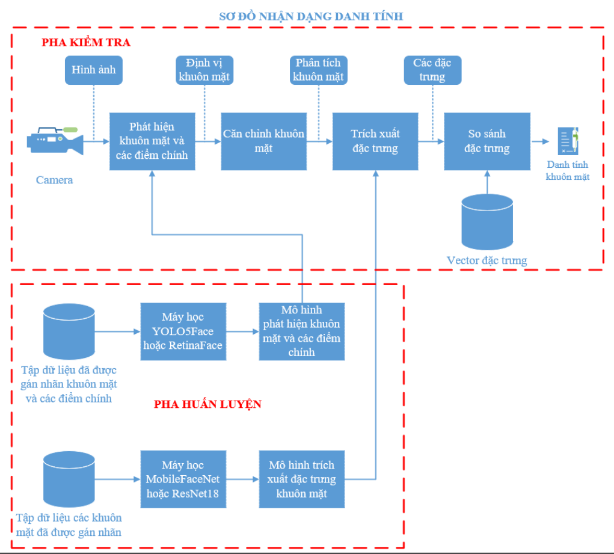
### Face detection
#### FDDB DATA
* Confusion matrix of YOLO5Face

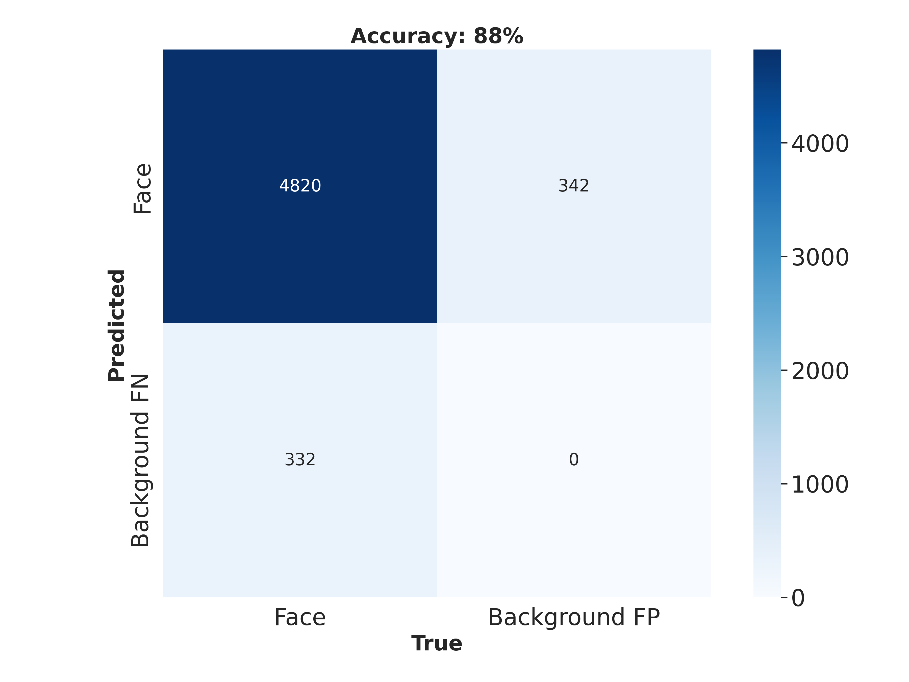
* Confusion matrix of RetinaFace


#### WIDERFACE Val
* Confusion matrix of YOLO5Face


* Confusion matrix of RetinaFace

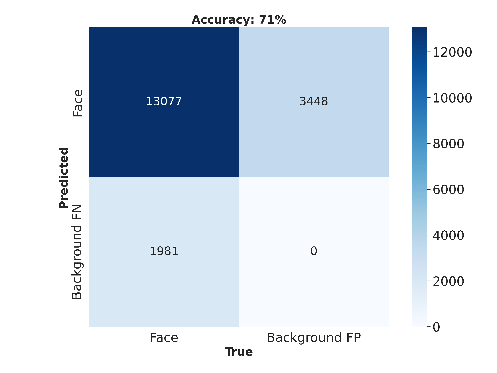
#### Result compare: Accuracy, Precision, Recall, Time processing
Config Computer:
+ CPU: AMD Ryzen 7 4800H với 16G RAM DDR4
+ GPU: NVIDIA GeForce GTX 1650 với 4G RAM DDR6

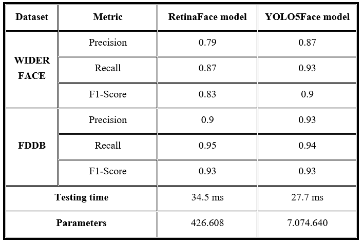

#### Face landmark loss

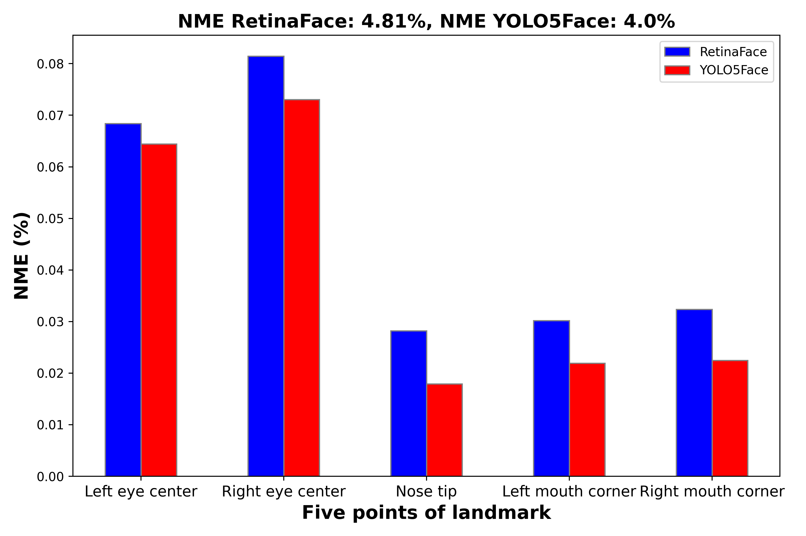
### Face recognition
#### Backbone compare:
* MobileFaceNet

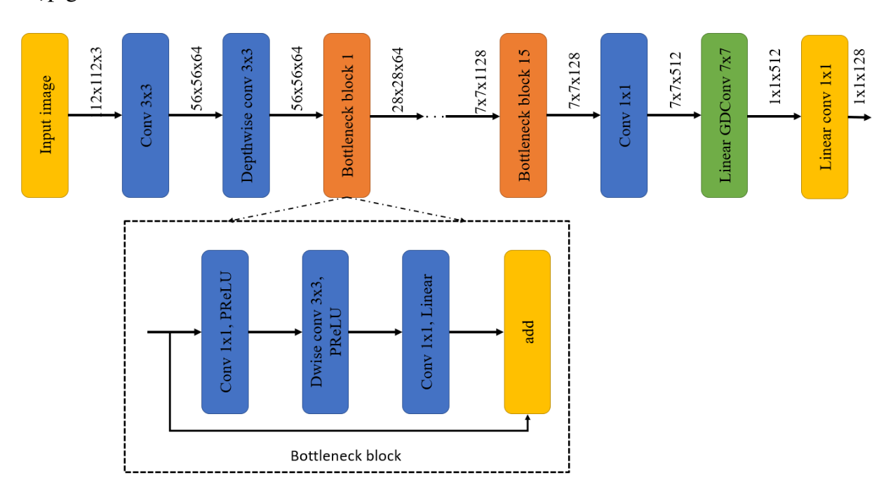
* ResNet18

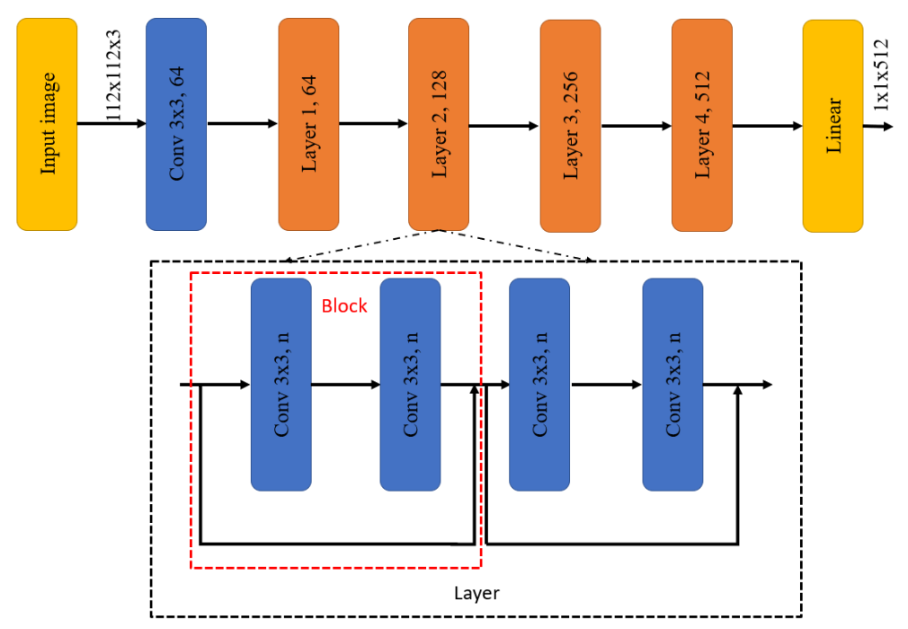
#### Methods compare: LOOCV (Leave-One-Out Cross-Validation), Time processing with FaceScrub data

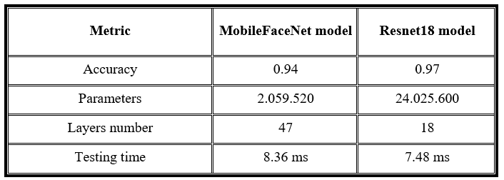
### Diagram Accuracy Thresh

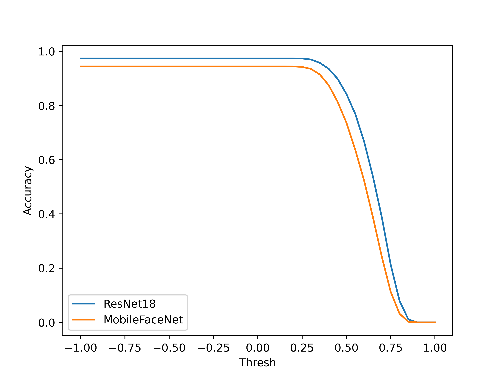
## Result human action pose
### Diagram

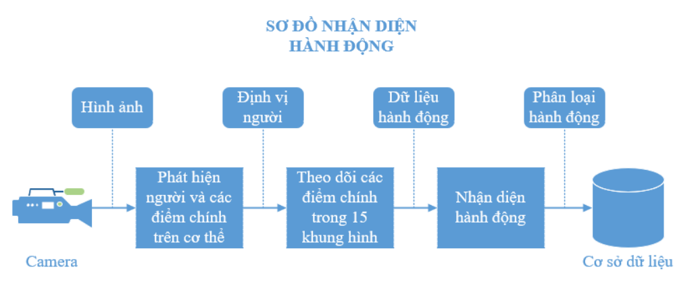
### Backbone
#### LSTM


### ST-GCN

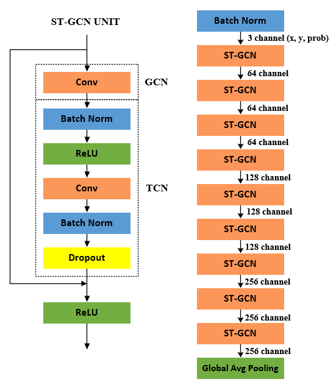

### Two Stream ST-GCN

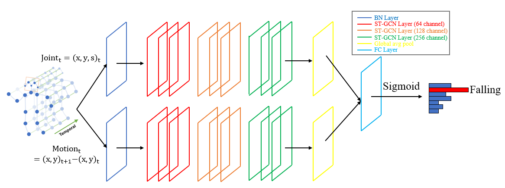
### Confusion matrix
* Model LSTM (Long Short Term Memory)

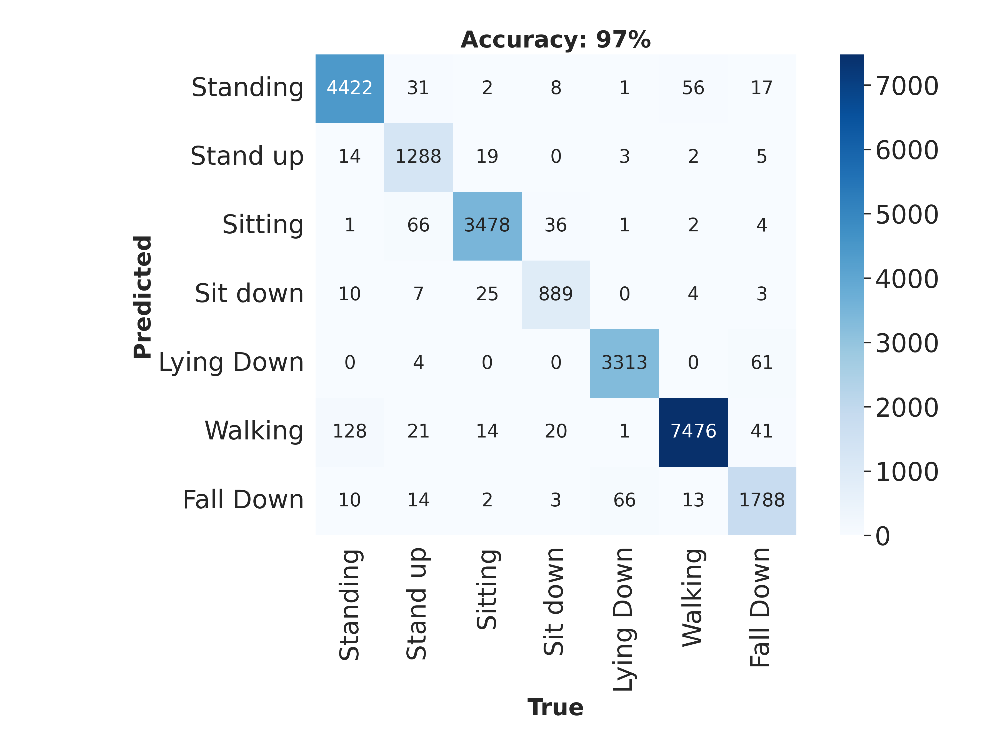
* Model ST-GCN (Spatial Temporal - Graph Convolutional Network)

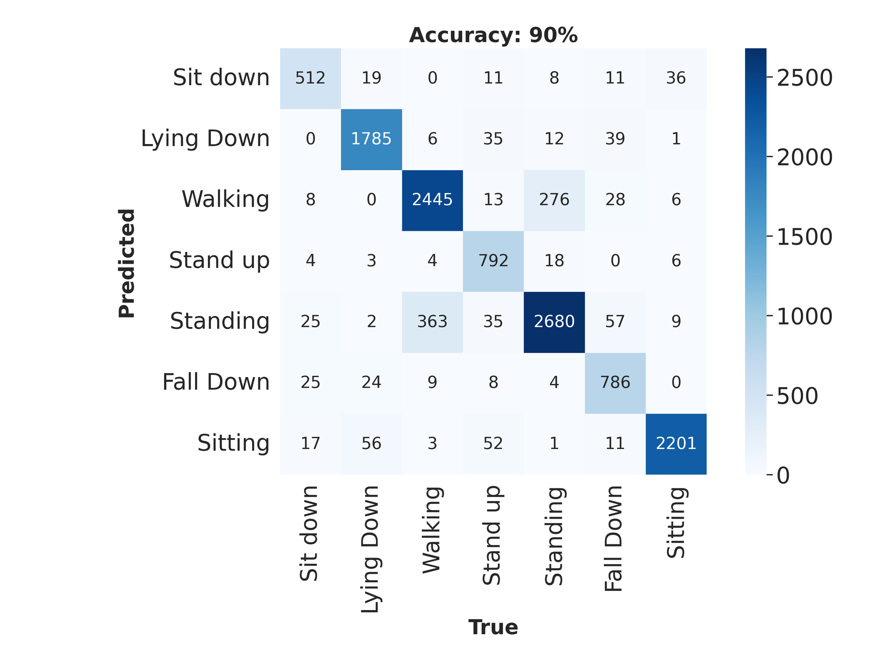
### Methods compare
Accuracy, Precision, Recall, F1-score, Time processing

Config Computer:
+ CPU: AMD Ryzen 7 4800H với 16G RAM DDR4
+ GPU: NVIDIA GeForce GTX 1650 với 4G RAM DDR6

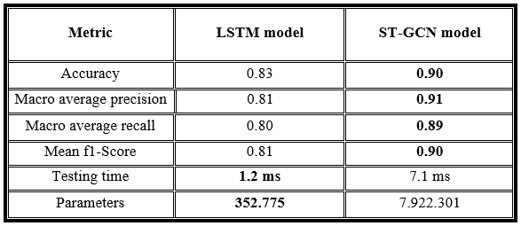

### Compare ST-GCN + YOLOv7-Pose and ST-GCN + YOLOv3 + Alphapose
Config Computer:
+ CPU: AMD Ryzen 7 4800H với 16G RAM DDR4
+ GPU: NVIDIA GeForce GTX 1650 với 4G RAM DDR6

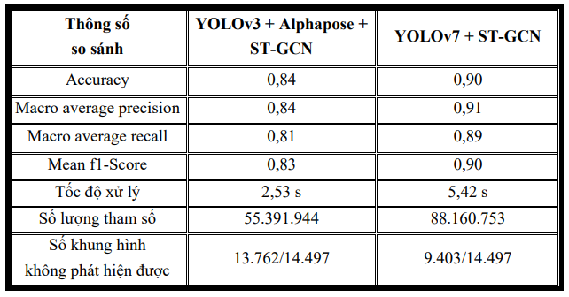

+ Confusion matrix of ST-GCN with skeleton data export from yolov3 + alphapose

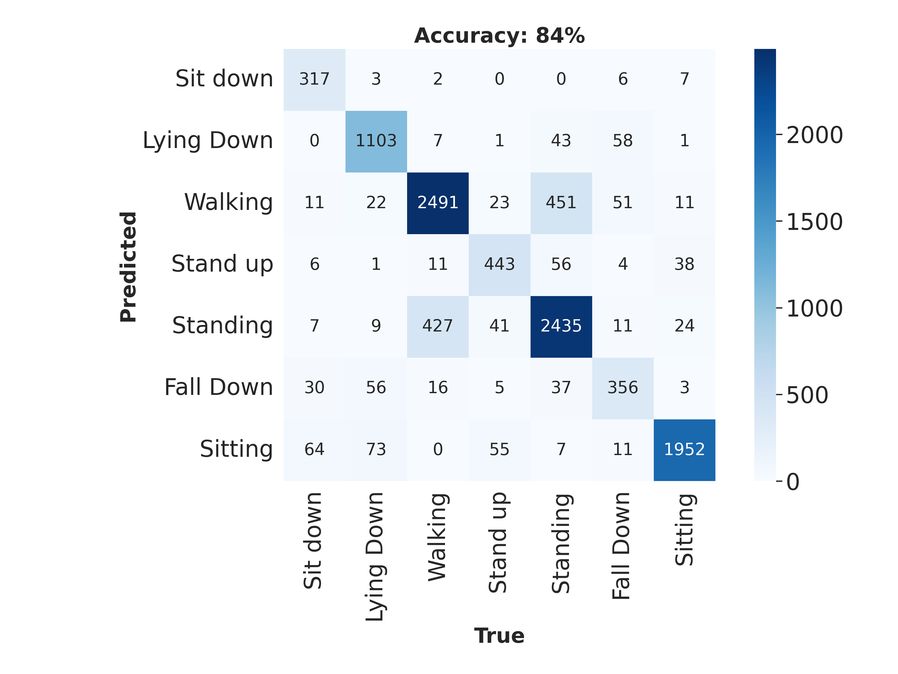

### Training
#### Human action
* https://github.com/DuyNguDao/LSTM.git
* https://github.com/DuyNguDao/ST-GCN-Pytorch.git
#### Face Detection
* https://github.com/deepcam-cn/yolov5-face.git
* https://github.com/biubug6/Pytorch_Retinaface.git
#### Face recognition
* https://github.com/DuyNguDao/ArcFace_Pytorch.git
## Citation
```
@article{
  title={The application of face recognition and action recognition for fall detection},
  author={Dao Duy Ngu, Le Van Thien, Tran Thi Minh Hanh},
  journal={},
  year={2022}
}
```
## Contact
```
The University of Da Nang, The University of Science and Technology
Address: 54, Nguyen Luong Bang street, Lien Chieu district, Da Nang City
Email: ddngu0110@gmail.com, ngocthien3920@gmail.com, hanhtran@dut.udn.vn
```
## Acknowledgements
* https://github.com/deepinsight/insightface.git
* https://github.com/deepcam-cn/yolov5-face.git
* https://github.com/WongKinYiu/yolov7.git
* https://github.com/biubug6/Pytorch_Retinaface.git
* https://github.com/GajuuzZ/Human-Falling-Detect-Tracks.git
* https://github.com/mikel-brostrom/Yolov5_StrongSORT_OSNet.git


