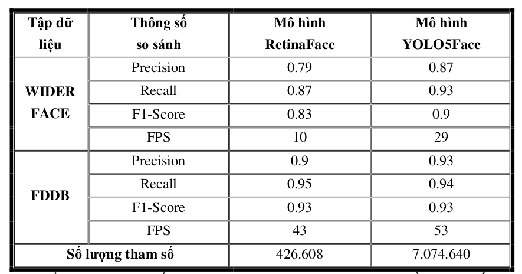
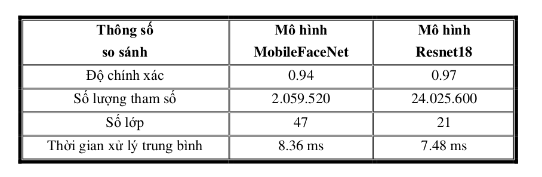

# IDENTITY AND HUMAN ACTION RECOGNITION
## Introduction
This is project of identity recognition and human action that is widely applied in life such as: falls in the elderly, stroke patients or behavior recognition in children
## video demo

## System Diagram


## Dev
```
Member:
 - DAO DUY NGU
 - LE VAN THIEN
Instructor: TRAN THI MINH HANH
```
## Usage
### Install package
```
git clone https://github.com/DuyNguDao/Project_Graduate.git
```
```
cd Project_Graduate
```
```
conda create --name human_action python=3.8
```
```
pip install -r requirements.txt
```
### Download
model yolov7 pose state dict:
[yolov7_w6_pose](https://drive.google.com/file/d/1z8WVeqbjUKeibV0ZRDL5tBac9Ry8AkB3/view?usp=sharing)
### Quick start
```
python detect_video.py
```
## Datasets and result model training
[dataset and result](https://drive.google.com/drive/folders/1vUVeRMsII_z8zrGlVC7mybRaUiY5lz_s?usp=sharing)
## Result face recognition
### Diagram


### Face detection
#### FDDB DATA
* Confusion matrix of YOLO5Face


* Confusion matrix of RetinaFace


#### WIDERFACE Val
* Confusion matrix of YOLO5Face


* Confusion matrix of RetinaFace


#### Result compare: Accuracy, Precision, Recall, Time processing



#### Face landmark loss


### Face recognition
#### Backbone compare:
* MobileFaceNet


* ResNet18


#### Methods compare: LOOCV (Leave One Of Cross Validation), Time processing with FaceScrub data


### Diagram Accuracy Thresh


## Result human action pose
### Diagram


### Confusion matrix
* Model LSTM (Long Short Term Memory)


* Model ST-GCN (Spatial Temporal - Graph Convolutional Network)


### Methods compare
Accuracy, Precision, Recall, F1-score, Time processing
<<<<<<< HEAD

=======


>>>>>>> 92b893776fc379b5e5fe84f6acba8a50cfb8e43a
### Training
* LSTM
```
https://github.com/DuyNguDao/LSTM.git
```
* Face Detection
```
https://github.com/deepcam-cn/yolov5-face.git
https://github.com/biubug6/Pytorch_Retinaface.git
```
* Face recognition
```
https://github.com/DuyNguDao/ArcFace_Pytorch.git
```
## Contact
```
Address: Da Nang University of Science and Technology
Email: 106180036@sv1.dut.udn.vn
```
## Acknowledgements
* https://github.com/deepinsight/insightface.git
* https://github.com/deepcam-cn/yolov5-face.git
* https://github.com/WongKinYiu/yolov7.git
* https://github.com/biubug6/Pytorch_Retinaface.git


